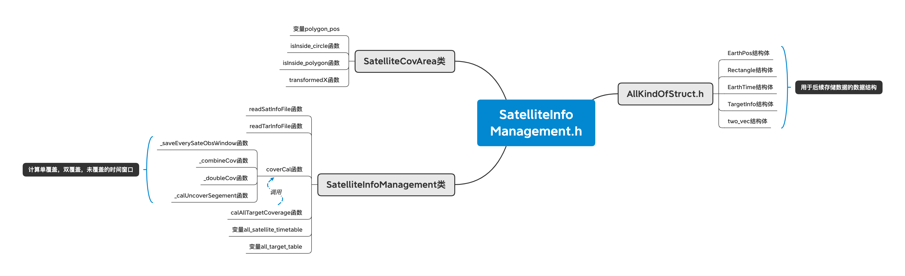

# Algo_SatelliteCovCalc&MissionPlanning
```c++
//  Readme.md
//  Project Name:    Algo_SatelliteCovCalc&MissionPlanning
//  IDE:           Xcode   c++11(or higher)
//  Created by 陈梓玮 on 2021/6/4.
//  Dependency ortools
//  Readme was Wrote in Pycharm editor
//  This Project is pure c++ code
```
# Dependency
[Ortools](https://developers.google.cn/optimization/introduction/overview)

# File structure 


- Header.h
  - this .h file is used to include some necessary headers
- AllKindOfStruct.h
  - this .h file is some structs' implementations which will be used in the following files
- SatelliteInfoManagement.hpp SatelliteInfoManagement.cpp
  - this .h and related .cpp file is used for Q1 problems' solutions
- SatelliteSchedulePlanning.hpp SatelliteSchedulePlanning.cpp
  - this .h and related .cpp file is used for Q2 & Q3 problems' solutions
    
***More details see XMind graph(mind map and structure map)***

# output & temporary files 
- ***mid_res\<X>.txt***用于存储存储第x个target文件内的每一个个卫星覆盖时间窗口 
- ***combine_cov_res\<X>.txt***用于存储第x个target文件内9颗卫星并集后的时间窗
- ***double_cov_res\<X>.txt***用于存储第x个target文件内9颗卫星并集后的二重覆盖时间窗口
- ***heuristic_result\<X>.txt***存储第x个target文件启发式结果的安排时间

# Attention 
This executable program can not be executed in windows, if you want to execute this program, please compile it again with c++11(or higher) and with dependency  
*data file path should be changed since I didn't use relative path*  
*data output & visualization see python matplot implementation*